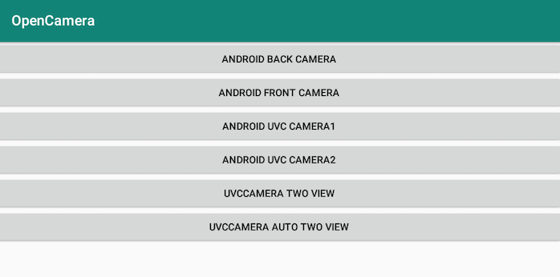

# OpenCamera

[中文版：README-CN](./README-CN.md)

## Introduction

Aim to design easy-to-use module to help develop camera app quickly and smoothly

Mainly based on 

- Android Camera API :arrow_right:
  - Android Back camera
  - Android Front camera

- Android Camera2 API  :arrow_right:
    - Android Back camera
    - Android Front camera

- UVCCamera API :arrow_right:
  - Android UVC camera1
  - Android UVC camera2
  - UVC Camera two view (open two uvc camera simultaneously by click) 
  - UVC Camera auto two view (open two uvc camera simultaneously automatically)

## Dependency

UVCCamera: https://github.com/saki4510t/UVCCamera

usbCameraCommon: https://github.com/braincs/USBCamera

- did a little enhancement on frame callback here 

